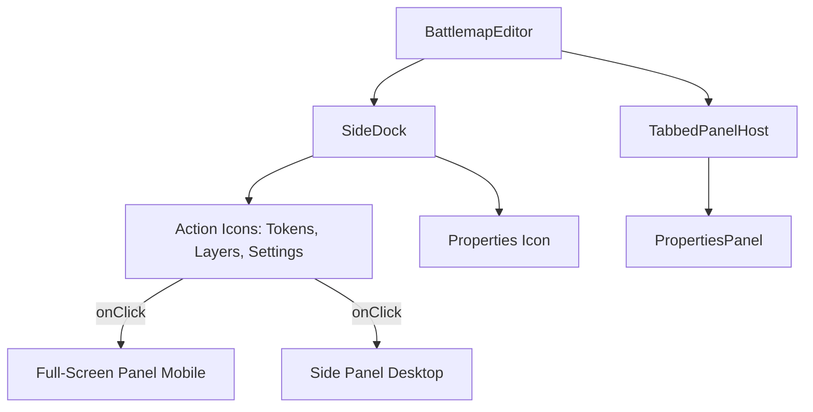

# Design: Responsive Battlemap Panels

## Architecture Overview



## 1. Token Library Redesign

### Current State
```
┌──────────────────────────┐
│ Token Library        [X] │
├──────────────────────────┤
│ [Search...]              │
│ Zoom: ──●──              │
│ [+ Add Token] [📁 Folder]│  ← Two separate buttons
├──────────────────────────┤
│ [folder] [token] [token] │
└──────────────────────────┘
```

### Proposed State
```
┌──────────────────────────┐
│ Token Library        [X] │
├──────────────────────────┤
│ [Search...]  [Zoom ─●─]  │
├──────────────────────────┤
│ [folder] [token] [token] │
│                          │
│                      [+] │  ← FAB opens menu
└──────────────────────────┘

FAB Menu (bottom sheet on mobile):
┌──────────────────────────┐
│ [🖼] Add Token           │
│ [📁] New Folder          │
└──────────────────────────┘
```

### Inline Folder Creation
When "New Folder" is tapped:
1. Insert a new folder item at the top of the grid
2. Auto-focus the name input inside the folder card
3. Save on blur/Enter, delete if empty on Escape

## 2. Layer Manager Drag-and-Drop

### Technology Choice
Use **@dnd-kit** for touch-friendly drag-and-drop (user approved installation):
- Touch and mouse support
- Accessibility (keyboard reordering)
- Smooth animations

### Implementation
```tsx
function LayerItem({ layer, index, onDragStart, onDragOver, onDrop }) {
  return (
    <div
      draggable={!isRestricted}
      onDragStart={(e) => onDragStart(e, index)}
      onDragOver={(e) => { e.preventDefault(); onDragOver(e, index); }}
      onDrop={(e) => onDrop(e, index)}
      className="layer-item"
    >
      {/* drag handle + layer content */}
    </div>
  );
}
```

## 3. Panel Deduplication Strategy

### Current Problem
```
panelLocations = {
  topRight: ["settings", "tokens", "properties"],  // ← duplicated with SideDock actions
  bottomRight: ["layers"],                          // ← duplicated with SideDock actions
}
```

SideDock shows action icons AND vertical labels for closed panels. This creates confusion.

### Solution
1. **Action Icons** (Settings, Tokens, Layers): Always visible in SideDock, toggle full panel
2. **Panel Labels** (Properties): Only show in SideDock when panel is closed

```tsx
// BattlemapEditor.tsx
const [panelLocations] = useState({
  topRight: ["properties"],  // Only properties uses tab system
  // Remove settings, tokens, layers from here
});

// SideDock actions remain for Settings, Tokens, Layers
// When clicked, they open as standalone panels, not tabs
```

## 4. Mobile Panel Behavior

### Breakpoint Strategy
```css
/* Mobile: < 768px */
.panel-container {
  position: fixed;
  inset: 0;
  z-index: 100;
  transform: translateX(100%);
  transition: transform 0.3s ease;
}
.panel-container.open {
  transform: translateX(0);
}

/* Desktop: >= 768px */
@media (min-width: 768px) {
  .panel-container {
    position: relative;
    width: 300px;
    transform: none;
  }
}
```

### Touch Gestures
- **Swipe right** on panel edge to close
- **Long press** on token for context menu
- **Swipe left** on layer row to reveal delete

## 5. Component Changes Summary

| Component | Changes |
|-----------|---------|
| `TokenManagerSidebar.tsx` | Add FAB, inline folder input, touch gestures |
| `LayerManagerPanel.tsx` | Add dnd-kit sortable, touch drag handles |
| `BattlemapEditor.tsx` | Simplify panelLocations, separate action panels |
| `SideDock.tsx` | Differentiate actions vs. panel labels |
| `TabbedPanelHost.tsx` | Larger touch targets, close button improvements |

## Dependencies
- `@dnd-kit/core` (to install)
- `@dnd-kit/sortable` (to install)
